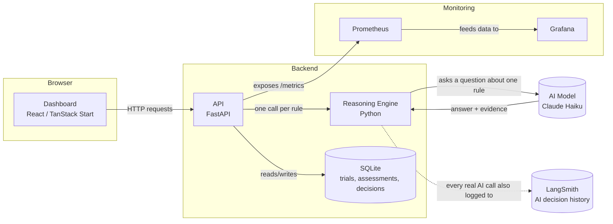

# CareMatch API

**An AI tool that helps hospital staff check if a patient qualifies for a clinical trial — and shows its work, every single time.**

**New here?** See `setup_guide.md` for step-by-step setup instructions, and `seed_data.md` for copy-paste examples to try once it's running.

---

## Table of Contents

- [Documentation Map](#documentation-map)
- [What This Project Does](#what-this-project-does)
- [Why It's Built This Way](#why-its-built-this-way)
- [How It Works](#how-it-works)
- [Architecture](#architecture)
- [Project Structure](#project-structure)
- [Tech Stack](#tech-stack)
- [The API](#the-api)
- [Running It Yourself](#running-it-yourself)
- [Environment Variables](#environment-variables)
- [Monitoring, Logging & Tracing](#monitoring-logging--tracing)
- [Testing](#testing)
- [Key Decisions (and Why)](#key-decisions-and-why)
- [Real Problems We Found and Fixed](#real-problems-we-found-and-fixed)
- [How Well Does It Actually Work?](#how-well-does-it-actually-work)
- [What's Not Built](#whats-not-built)

---

## Documentation Map

Everything worth reading, and what to read it for. This file (`README.md`) is the technical overview; the four guides below take you from "nothing installed" to "I understand the whole project."

**For everyone — read in this order:**

| Doc | Read it to |
|---|---|
| `setup_guide.md` | Get the app running, step by step, from a fresh computer. This is the only doc you need to start. |
| `seed_data.md` | Type in exact values and confirm the app is actually working with your own eyes. |
| `monitoring_guide.md` | Understand what Prometheus and Grafana are, and look at the app's health numbers yourself — click by click. |
| `project_summary.md` | Get the whole story: what got built, what actually broke and got fixed, and the honest results. |

> **Two similar-sounding terms, worth telling apart:** "Needs More Information" is what the AI suggests when it can't tell from the record alone (see the `suggested_status` field). "Needs More Review" is a separate action a coordinator can choose afterward, to flag an assessment for later follow-up. One comes from the AI, the other from a human — they are not the same thing.

**For developers:**

| Doc | Read it to |
|---|---|
| `dashboard/README.md` | Developer notes for the dashboard — how to run it and what's built. |
| `dashboard/src/routes/README.md` | Internal note on how the dashboard's file-based routing works. |

The suggested path for a newcomer is simple: `setup_guide.md` → `seed_data.md` → `monitoring_guide.md` → `project_summary.md`.

---

## What This Project Does

Hospitals run clinical trials — tests of new medicines or treatments. Before a patient can join one, someone has to check if they qualify against a list of rules (called a **protocol**). Today, a hospital staff member called a **research coordinator** does this by hand — reading through a patient's whole medical file and checking it line by line. It's slow, and it's easy to miss something.

**CareMatch reads the patient's file and the trial's rules, and hands the coordinator a clear report** — not a decision. It never says "yes, this patient qualifies" on its own. Instead, it checks every single rule one at a time and says: *this one clearly matches, this one clearly doesn't, and this one we can't tell from the record.* Then a real human decides.

## Why It's Built This Way

Two things usually break AI tools in hospitals:

1. **It's too expensive to plug in.** Big AI systems often need $250,000+ just to connect to a hospital's existing computer systems.
2. **Nobody trusts a black box.** If an AI just says "excluded" with no explanation, no doctor is going to act on that — and legally, they probably shouldn't.

CareMatch is built to avoid both. It's a small, simple tool that plugs into anything with a basic web connection, and it **never gives an answer without showing exactly how it got there.**

---

## How It Works

```mermaid
flowchart TD
    A[Patient's medical record + Trial's rulebook] --> B[AI checks each rule, one at a time]
    B --> C{For every single rule}
    C --> D[✅ Matches - with a quote as proof]
    C --> E[❌ Does Not Match - with a quote as proof]
    C --> F[❓ Unclear - because info is missing]
    D --> G[All results bundled into one report]
    E --> G
    F --> G
    G --> H[Human coordinator reviews the report]
    H --> I{Coordinator decides}
    I --> J[✅ Accept]
    I --> K[❌ Deny, with a written reason]
    I --> N[❓ Needs More Review]
    J --> L[Decision saved permanently]
    K --> L
    N --> M[Assessment stays open, flagged]
    M --> H
```



**The one rule that never changes:** the AI's answer is always a *suggestion*. Even if every single rule looks like a clean match, a human still has to make a final call — Accept or Deny — before it counts as anything real. The third option, "Needs More Review," is not a dead end: it simply keeps the assessment open while the coordinator gathers the missing information, and the decision is finished with an Accept or Deny later. There is no way to skip this step — it's built into the code itself, not just a policy someone has to remember.

---

## Architecture



**In plain words:**
- **Dashboard** — the webpage a coordinator actually looks at
- **API** — the doorway other systems (like the dashboard) use to send data in and get answers back
- **Reasoning Engine** — the actual "brain." It goes through a trial's rules one at a time
- **SQLite database** — where trial rules, patient assessments, and coordinator decisions are permanently stored, so nothing is lost if the app restarts
- **AI Model** — the underlying language model that reads the patient text and judges each rule
- **Prometheus & Grafana** — a health dashboard for the *system itself* (is it fast? is it breaking? how many checks has it done?), separate from the coordinator's dashboard
- **LangSmith** (optional) — a permanent, browsable history of every individual AI decision, useful for reviewing or evaluating reasoning quality later

---

## Project Structure

This shows the key files — a few generated/config files (requirements.txt, Dockerfiles, test_data/) are left out to keep this readable.

```mermaid
flowchart TD
    ROOT[carematch/] --> RE[reasoning_engine/<br/>The AI brain — reads one rule + one patient record, gives an answer]
    RE --> RE_SCHEMA[schema.py<br/>Defines the exact shape of every answer — no shortcuts allowed]
    RE --> RE_PROTO[protocol.py<br/>Defines what a trial's rulebook looks like]
    RE --> RE_LLM[llm_client.py<br/>The actual call to the AI model, with retries, safety checks, and AI tracing]
    RE --> RE_ENG[engine.py<br/>Loops through all the rules and combines the results]
    RE --> RE_RUN[run_real_assessment.py<br/>Script to test real AI reasoning yourself, using your own API key]
    RE --> RE_TEST[test_engine.py<br/>Automated tests — no API key needed]
    RE --> RE_REQ[requirements.txt]
    RE --> RE_ENV[.env.example<br/>Copy to .env if running this folder's scripts on their own]
    RE --> RE_DATA[test_data/<br/>Sample patient records used by the automated tests]
    ROOT --> API[api/<br/>The doorway — turns the reasoning engine into a web service]
    API --> API_MAIN[main.py<br/>All the API endpoints, plus request logging]
    API --> API_DB[db.py<br/>SQLite persistence — trials, assessments, decisions survive restarts]
    API --> API_TEST[test_api.py<br/>Automated tests for the API itself]
    API --> API_DOCKER[Dockerfile]
    API --> API_REQ[requirements.txt]
    ROOT --> DASH[dashboard/<br/>The webpage the coordinator actually uses]
    DASH --> DASH_SRC[src/]
    DASH_SRC --> DASH_ROUTES[routes/<br/>The 4 pages: New Assessment, Assessment Review, Trial Setup, Trials]
    DASH_SRC --> DASH_COMP[components/<br/>Reusable pieces, like the rule result cards]
    DASH_SRC --> DASH_HOOKS[hooks/<br/>Small reusable bits of frontend logic]
    DASH_SRC --> DASH_API[lib/api.ts<br/>The code that talks to the real API]
    ROOT --> OBS[observability/<br/>Retired — an early standalone monitoring test.<br/>Real monitoring now lives directly inside api/main.py]
    ROOT --> EV[run_evaluation.py<br/>The 12-patient accuracy test script — see project_summary.md for results]
    ROOT --> PS[project_summary.md<br/>The full story: real bugs found, decisions made, evaluation results]
    ROOT --> SETUP[setup_guide.md<br/>Step-by-step setup instructions for a first-time run]
    ROOT --> SEED[seed_data.md<br/>Copy-paste examples to try once the app is running]
    ROOT --> MON[monitoring_guide.md<br/>What Prometheus and Grafana are, and how to look at the numbers yourself]
    ROOT --> DC[docker-compose.yml<br/>Starts everything — API, dashboard, monitoring — with one command]
    ROOT --> PC[prometheus_config.yml<br/>Tells Prometheus which services to watch, including itself]
    ROOT --> RM[README.md<br/>You are here, at the project root]
```



---

## Tech Stack

| Piece | What It's Built With | Why |
|---|---|---|
| Reasoning Engine | Python, Pydantic | Pydantic forces every AI answer to follow our exact required shape — an answer that doesn't fit gets rejected automatically |
| AI Model Access | Anthropic Claude (direct) or OpenRouter | Two ways to reach an AI model, switchable with one setting, no code changes needed |
| API | FastAPI | Lightweight, fast, and automatically generates interactive docs |
| Persistence | SQLite | A real, permanent database that needs no separate server — one file on disk. Trials, assessments, and decisions all survive a restart |
| Dashboard | React + TanStack Start + Tailwind CSS | A modern, fast web app framework |
| Metrics | Prometheus + Grafana | Industry-standard tools for watching the system's health in real time |
| AI Tracing (optional) | LangSmith | Records every individual AI reasoning call permanently, so decisions can be reviewed or evaluated later — not just watched live |
| Packaging | Docker + Docker Compose | Lets the whole project start with one command, on any computer |

---

## The API

| Method | Path | What It Does |
|---|---|---|
| GET | `/health` | Simple check — is the API alive? |
| GET | `/metrics` | Raw performance/usage numbers, read by Prometheus |
| POST | `/trials` | Register a new trial's rulebook |
| GET | `/trials` | List every trial that's been registered |
| GET | `/trials/{trial_id}` | Look up one specific trial |
| POST | `/assess` | Run a real eligibility check for one patient against one trial |
| GET | `/assessments/{assessment_id}` | Look up a past assessment |
| POST | `/assessments/{assessment_id}/decision` | Record the coordinator's decision — Accept, Deny, or Needs More Review |

Every response also includes an `X-Request-ID` header — a unique ID for that specific request, useful for tracing a problem through the logs later (see [Monitoring, Logging & Tracing](#monitoring-logging--tracing)).

A coordinator decision is one of three values: `accepted`, `denied`, or `needs_more_review`. **Accept and Deny are final** — once recorded, the assessment is locked. **`needs_more_review` is temporary.** It just flags the assessment as "still being worked on" and leaves it open, so the coordinator can come back later and turn it into a final Accept or Deny once the missing information arrives.

**Example — what you get back from `/assess`:**
```json
{
  "assessment_id": "67207011-cda7-4ba9-a2f6-4388d7144fd5",
  "assessment": {
    "patient_id": "P-1001",
    "trial_id": "T-004",
    "suggested_status": "likely_eligible",
    "requires_coordinator_approval": true,
    "rule_results": [
      {
        "rule_id": "INC-01",
        "rule_text": "Patient must be 50 years of age or older",
        "status": "matches",
        "evidence": "60-year-old patient"
      }
    ]
  },
  "decision": null,
  "provider_used": "anthropic",
  "model_used": "claude-haiku-4-5-20251001"
}
```
Notice: no confidence score, no flat "yes." Just a status, a quote, and a note that a human still needs to sign off.

---

## Running It Yourself

**The normal way to run CareMatch is with real AI (`LLM_MODE=real`).** Before any client demo, confirm the top-level `.env` has `LLM_MODE=real` and a valid API key — a missing key fails loudly with a 502, never quietly. There is also a **free developer testing mode** that returns placeholder answers; it exists only for the automated test suite and plumbing checks, and it must never be active during a demo. See `setup_guide.md` for full step-by-step instructions.

**Everything at once, with Docker (recommended):**
```bash
docker compose up -d --build
```
Then open:
- Dashboard: `http://localhost:8080`
- API docs: `http://localhost:8000/docs`
- Prometheus: `http://localhost:9090`
- Grafana: `http://localhost:3000`

**Data persists across restarts** — running `docker compose down` will never wipe anything:
- Trials, assessments, and coordinator decisions are saved in SQLite (`api/db.py`), stored in a Docker volume (`api_data`) — this has been tested by actually killing the running server process and confirming the data survives.
- Prometheus and Grafana also store their data in named volumes (`carematch_prometheus_data`, `carematch_grafana_data`).

**Running pieces separately (for development):**
```bash
# Backend
cd api
pip install -r requirements.txt
uvicorn main:app --reload

# Frontend, in a separate terminal
cd dashboard
npm install
npm run dev
```

---

## Environment Variables

**`LLM_MODE=real` is the normal configuration and the default.** Each variable below is only needed if you want to turn on the specific feature it controls. The free developer testing mode (`LLM_MODE=fake`) is for running the automated test suite without cost — it is never the configuration you run a real demo with.

There are two different `.env` files depending on how you're running things:

| File | When You Need It | Template Available? |
|---|---|---|
| `carematch/.env` (project root) | Running everything via Docker — `docker-compose.yml` reads this one | Yes — copy `carematch/.env.example` |
| `reasoning_engine/.env` | Running the reasoning engine's own scripts directly, without Docker | Yes — copy `reasoning_engine/.env.example` |

| Variable | What It Does | Required When |
|---|---|---|
| `LLM_MODE` | `"real"` (default, normal) actually calls the AI model. `"fake"` is a **free developer testing mode** that returns placeholder answers — used only by the automated test suite, never in a real demo | Never — defaults to `"real"` |
| `LLM_PROVIDER` | Which AI service to use: `"anthropic"` or `"openrouter"` | Never — has a default |
| `ANTHROPIC_API_KEY` | Your Anthropic key | Only if `LLM_MODE=real` and `LLM_PROVIDER=anthropic` |
| `ANTHROPIC_MODEL` | Which Anthropic model to use | Never — has a default |
| `OPENROUTER_API_KEY` | Your OpenRouter key | Only if `LLM_MODE=real` and `LLM_PROVIDER=openrouter` |
| `OPENROUTER_MODEL` | Which model via OpenRouter | Never — has a default |
| `LANGSMITH_TRACING` | `"true"` turns on permanent AI decision logging | Never — defaults to off |
| `LANGSMITH_API_KEY` | Your LangSmith key | Only if `LANGSMITH_TRACING=true` |
| `LANGSMITH_PROJECT` | Which LangSmith project traces go into | Never — has a default |
| `LANGSMITH_WORKSPACE_ID` | Your LangSmith workspace ID | Only if tracing is on **and** your key is an org-scoped "Service" key (starts with `lsv2_sk_`) — LangSmith rejects requests without it in that case |
| `CAREMATCH_DB_PATH` | Where the SQLite database file is stored | Never — has a sensible default location |

**Good to know:** a missing or misconfigured LangSmith key never breaks the app itself — tracing failures are silently logged, but every real feature keeps working normally either way.

**Never commit either real `.env` file** — only the `.env.example` templates (with no real secrets in them) belong in version control.

---

## Monitoring, Logging & Tracing

CareMatch has three separate, complementary ways of watching what the system is doing — each answering a different question. **Want to look at these numbers yourself, click by click? See `monitoring_guide.md`.**

### 1. Prometheus + Grafana — "Is the system healthy?"
Tracks system-wide numbers over time: how many assessments have run, how long reasoning takes, how often coordinators accept vs. deny, and standard web traffic stats. Prometheus collects the numbers (configured in `prometheus_config.yml`, which also watches its own health); Grafana turns them into charts. Good for spotting trends — "did things slow down this week?" — not for looking at one specific event.

### 2. Request Logging — "What happened on this exact request?"
Every single request to the API gets a unique ID (visible in the `X-Request-ID` response header) and one log line recording what happened: which endpoint, how long it took, what it returned. If something goes wrong for one specific user action, this is how you'd trace it — "show me everything about request abc123."

### 3. LangSmith (optional) — "Why did the AI decide this?"
While Prometheus shows *how many* checks ran, LangSmith shows the actual *content* of each one — the exact question asked and the exact answer given, for every single rule the AI ever evaluated, permanently stored and browsable. This is useful for reviewing reasoning quality after the fact, well beyond what a live dashboard number can show. Entirely optional — the app works fully without it, and a failure to record a trace never affects a real request.

---

## Testing

```bash
# Reasoning engine tests (no API key needed — uses a fake AI for testing)
cd reasoning_engine
pytest test_engine.py -v

# API tests (also free — forces fake mode automatically, uses a throwaway database)
cd api
pytest test_api.py -v
```

Both test suites are fully automated and cost nothing to run, since they never make a real call to an AI model, and never touch the real database.

---

## Key Decisions (and Why)

| Decision | Why |
|---|---|
| **Never a flat yes/no** | A decision with no explanation can't be trusted or checked. Every answer comes with a direct quote as proof. |
| **No confidence score, anywhere** | We deliberately left this out. A percentage score can feel more certain than it actually is, and it was explicitly ruled out during planning. |
| **A human always makes the final call** | Even a clean "everything matches" case still needs a person to make a real decision — Accept or Deny — or deliberately flag it for more review. Nothing is ever decided by the AI alone. This is enforced in the code itself — there's no way around it. |
| **Rules are written by hand, not read from a PDF automatically** | Automatically parsing rules out of messy trial documents is a much bigger, riskier problem. For now, a human converts the rulebook into a clean checklist first. |
| **Exclusion rules are phrased as plain statements, not "must not" rules** | Testing showed the AI reasoning got confused by double-negatives. "Patient is taking Warfarin" works much better than "Patient must not be taking Warfarin." |
| **When information is missing, the AI says so — it doesn't guess** | A wrongly excluded patient never gets a second chance. Being cautious costs less than being wrong. |
| **A real database, not just memory** | Early versions lost everything on restart. A tool coordinators actually rely on can't forget their decisions. |

---

## Real Problems We Found and Fixed

Building this surfaced some genuine bugs — the useful kind, found and fixed before this ever touched anything real:

1. **Confusing rule wording tripped up the AI.** Rules phrased as "must not be taking X" caused wrong answers almost every time. Fixed by rephrasing rules as plain statements instead.
2. **The AI guessed too confidently when information was simply missing.** "No screening on file" was being read as "doesn't have the condition." Fixed by explicitly telling the AI to say "unclear" instead of guessing.
3. **A single bad AI response could crash the whole check.** Now, if the AI's answer doesn't fit the expected format, that one rule safely falls back to "unclear" instead of breaking everything.
4. **A leftover test service was quietly stealing web traffic meant for the real system**, because both were using the same computer port. Fixed by removing the old service entirely and building monitoring directly into the real system instead.
5. **The app forgot everything every time it restarted.** All trials and assessments lived only in memory. Fixed by adding a real SQLite database — tested by actually killing the running server process and confirming the data survived.

*(Full details of each issue, exactly what caused it and how it was proven fixed, are in `project_summary.md`.)*

---

## How Well Does It Actually Work?

Since we didn't have a real hospital to test with, we ran a stand-in test: **12 made-up patients, each with a known correct answer, run through the real AI.**

**Result: 12 out of 12 correct. Zero patients wrongly excluded.**

This included tricky cases on purpose — patients right at an age cutoff, patients failing multiple rules at once, and irrelevant information mixed in to see if it would cause confusion. All handled correctly.

**Being honest about the limits:** 12 patients is a good sign, not final proof. A real trial usually has more rules than the 3 we tested with, and real patient records are messier than our clean test examples.

---

## What's Not Built

Two things are intentionally left for later, because they need more than code to finish:

- **Legal & security review** — getting the paperwork and security testing done to safely handle real patient data. This needs real lawyers and real security auditors.
- **Turning this into an actual product** — onboarding real hospitals, handling many trials at once, figuring out pricing. This needs a real business, not more engineering.

Everything else — the AI reasoning, the API, the database, the dashboard, monitoring, logging, tracing, and testing — is built, working, and verified.