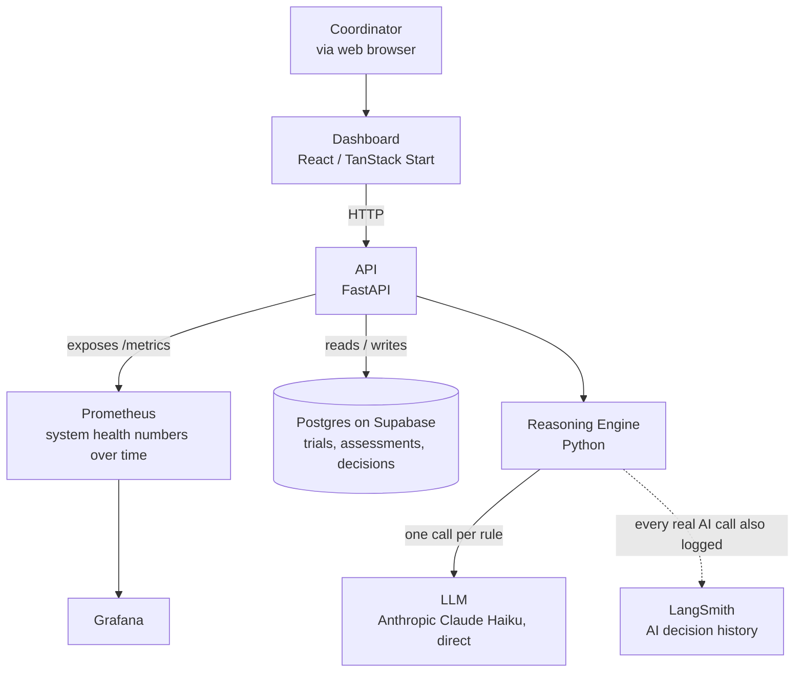
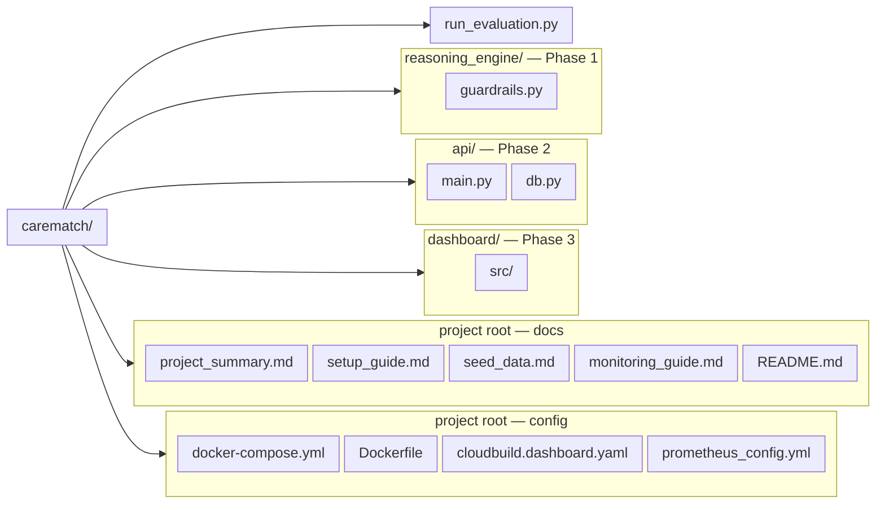

# CareMatch API — Project Summary

**Status: Prototype complete through Phase 5 (simulated), and deployed live on Google Cloud Run. Phases 6-7 require real-world adoption, not more code.**

This document is the single narrative summary of the whole project — what it is, what got built, what actually broke and got fixed, and what the real, honest results are. Everything described here was actually run and verified, not just written and assumed to work.

---

## The Problem

Hospitals running clinical trials have to check whether each patient qualifies, against a checklist of rules (inclusion/exclusion criteria). This is done by hand today, by a **research coordinator** reading through medical records — slow, and easy to miss something in a long chart.

Two things make AI adoption in this space hard in practice:
- **Cost** — typical enterprise AI integrations run \$250K–\$500K per hospital
- **Trust** — a black-box "yes/no" verdict is unusable in a clinical/legal setting with no way to check it

## The Idea

CareMatch is a lightweight reasoning layer, not a black box. It never gives a flat yes/no — every result is a structured, per-rule breakdown with a direct quote from the patient record as evidence, and a human coordinator always makes the final call.

```json
{
  "suggested_status": "likely_eligible",
  "requires_coordinator_approval": true,
  "rule_results": [
    {"rule_id": "INC-01", "status": "matches", "evidence": "60-year-old patient"}
  ]
}
```

---

## What Got Built

| Layer | What It Is | Status |
|---|---|---|
| **Reasoning engine** | Python core that walks a trial's rules one at a time against a patient record, calling an LLM per rule | ✅ Built, 29/29 tests passing, tested with a real LLM |
| **API** | FastAPI doorway — register trials, run assessments, list assessment history, record coordinator decisions | ✅ Built, 20/20 tests passing |
| **Dashboard** | React/TanStack Start UI — New Assessment, Assessment Review, Trial Setup, Trials, Assessment History | ✅ Built, wired to the real API, browser-tested |
| **Docker** | All services containerized, one `docker-compose up` starts everything | ✅ 4 containers running together |
| **Deployment** | Live on Google Cloud Run — API and dashboard reachable from anywhere (URLs in the README) | ✅ Deployed and health-checked |
| **Browser E2E** | Playwright suite driving the real UI against the local stack | ✅ Passes with `--workers=1` |
| **Observability** | Prometheus + Grafana, built into the real API (not a separate toy service) | ✅ Real metrics, real dashboard |

## Architecture



Every request into the API also passes through a small logging layer: it gets a unique ID (returned in the `X-Request-ID` header), and one structured log line records what happened for that request.

---

## Real Bugs Found and Fixed

This is the part that matters most — not that bugs happened, but that they were found *before* this touched anything real, and each one is now backed by a regression test.

### 1. Negated exclusion phrasing confused the model
**Found:** Exclusion rules phrased as "Patient must **not** be taking Warfarin" caused the model to answer `does_not_match` almost regardless of the actual facts — a double-negative it consistently got wrong.
**Fixed:** Rephrased exclusion criteria as plain, positive disqualifying statements ("Patient is currently taking Warfarin"), and made the prompt explicitly state what a match means per rule category.
**Verified:** Re-tested in a later 12-patient batch — every Warfarin check across all patients came back correctly polarized.

### 2. Overconfident inference from absence
**Found:** Given "no diabetes screening on file," the model confidently answered "does not have diabetes" — inferring a negative from an absence, rather than flagging genuine uncertainty.
**Fixed:** Explicit prompt instruction: prefer `unclear` over an inferred answer whenever the record doesn't state something directly.
**Verified:** A later test specifically contrasted "no history of diabetes" (correctly confident) against "no diabetes screening on file" (correctly unclear) — both handled correctly.

### 3. Malformed LLM output could crash an entire assessment
**Found:** If the LLM returned an invalid status value or a missing field, the whole assessment would crash instead of failing gracefully.
**Fixed:** Wrapped rule evaluation in validation with a safe fallback to `unclear` — one bad rule result can no longer take down the whole assessment.
**Verified:** 4 dedicated tests, including proof that one malformed rule doesn't affect other valid rules in the same assessment.

### 4. Metrics double-counted, wrong model naming, confidence field crept back in
**Found during code review of an early, larger alternative codebase** that was ultimately set aside — a metric was incremented twice per event, status field naming drifted from the locked schema, and a "confidence score" had been reintroduced despite that being explicitly ruled out in planning.
**Action:** That codebase was not used. Confirms the value of the Phase 0 planning discipline — these were real, working-code mistakes that planning decisions were specifically designed to prevent.

### 5. Docker port conflict silently routed traffic to the wrong container
**Found:** An old, unrelated container from early Prometheus/Grafana testing was still running on the same port as the real API. Windows resolved `localhost` to the old container first, causing real requests to silently hit the wrong server and return a misleading 404.
**Fixed:** Retired the old standalone container entirely; observability is now built into the real API, in the same Docker Compose stack — structurally impossible for this exact conflict to recur.

---

## Harness Hardening

Beyond the core reasoning loop, four additional safety layers were built in, addressing gaps identified during initial planning:

1. **Malformed output handling** — see bug #3 above
2. **Prompt injection defense** — patient records are wrapped in explicit data-only delimiters, with instructions to never treat their contents as commands. *(Honestly documented as a real mitigation, not a guarantee — full adversarial testing would need a dedicated red-team exercise.)*
3. **Token usage visibility** — every real LLM call logs its token cost and a running session total
4. **Model/provider traceability** — every assessment records exactly which AI model produced it

**Deliberately not built, and why:** bias/fairness auditing (needs real-world pilot data to be meaningful), model version pinning with rollback (an operational concern for real deployment, not a prototype), formal cost budget caps (visibility came first).

---

## Evaluation Results (Simulated Phase 5)

A real hospital pilot wasn't available for this project, so a substitute evaluation was run instead: 12 synthetic patients, each with a human-decided correct answer, run through the real system end-to-end (real Anthropic Claude Haiku calls, not mocked).

**Result: 12/12 correct (100% agreement), 0 false exclusions.**

The batch was deliberately designed to re-test the two reasoning bugs above, plus:
- **Boundary conditions**: a patient exactly at the age cutoff (correctly eligible) vs. one year under (correctly excluded)
- **Multi-failure cases**: a patient failing three rules simultaneously — all three correctly identified, not just the first one noticed
- **Distractor information**: an unrelated allergy noted in the record, correctly ignored

**Honest limits of this result:** 12 cases is a real signal, not statistical proof — a larger batch (30-50+) would be more robust. One trial with three simple rules is far simpler than a real trial's typical 10+ criteria. This was synthetic, clean data — real clinical notes are messier and more inconsistent.

---

## The Senior-Review Round

A later senior review of the finished prototype led to another round of real work. Everything below was actually changed, rebuilt, and verified against the running system — not just edited and assumed fine.

### SQLite persistence — the app stopped forgetting

The prototype originally kept trials and assessments in memory, so restarting the app wiped everything. Trials, assessments, and coordinator decisions then moved into a real SQLite database (`api/db.py`). This was proven with the harshest test available: we actually killed the running server process, restarted it, and confirmed the data came back exactly as it was.

*(Superseded — see "Postgres (Supabase) — persistence moved to the cloud" below for where the data lives today.)*

### LangSmith tracing — the AI's reasoning is now recorded

Every real AI call is now logged to LangSmith, so an individual decision can be reviewed long after it happened. This is proven with real evidence, not a claim: a live assessment produced three successful trace records, each with its own run ID and a direct link to the full reasoning inside LangSmith.

Setting it up surfaced a genuine authentication bug. The key in use is an org-scoped "service" key, and LangSmith quietly rejected every request with `403 Forbidden`. The cause: org-scoped keys need an explicit **workspace ID** in the configuration, and we hadn't set one. Adding `LANGSMITH_WORKSPACE_ID` fixed it, and the traces then appeared.

### Request logging — every request is now traceable

A small middleware layer gives every API request a unique ID, returned in the `X-Request-ID` response header and written into one structured log line (which endpoint, how long it took, what it returned). Proved with a real request: the header on the response and the corresponding log line matched, byte for byte.

### Prometheus config — renamed, expanded, and one genuine lesson

The monitoring config was renamed to `prometheus_config.yml` and expanded with clearer scrape settings and a job that watches Prometheus's own health. The expansion surfaced a real mistake: retention settings were first put in the config file, and Prometheus refused to start, rejecting the file with a real startup error (`field retention.time not found in type config.plain`). Retention cannot live in the config file — it has to be a command-line flag. The fix was to pass `--storage.tsdb.retention.time=30d` when starting Prometheus, after which the config loaded cleanly and both monitored targets reported healthy.

### Coordinator decisions — from 2 options to 3

The decision system was redesigned from two options ("Approve" / "Override") to three: **Accept**, **Deny**, and **Needs More Review**. This was a deliberate design change, not a rename:

- **Accept** and **Deny** are final — once recorded, the assessment is locked.
- **Needs More Review** is deliberately not a dead end. It keeps the assessment open and flagged, so the coordinator can come back later and finish with a real Accept or Deny once the missing information arrives.

The hard part was the data already in the database. Older assessments stored decisions as `"approved"` or `"overridden"`, and the new code had to keep reading those rows without crashing — and without rewriting them, since they are records of what actually happened. The solution: the API only accepts the three new values on input, but tolerates any stored value on output. Proven with the real database: an old `"approved"` row still loads and displays correctly today. *(The refined confirmation flow for the Needs More Review option is described below in "Needs More Review — flagged, not bounced".)*

### The Trials list page

The dashboard gained a fourth page — **Trials** — which lists every registered trial and its rules in a plain, expandable view. It sits in the top navigation alongside New Assessment, Assessment Review, and Trial Setup.

### The Assessment History page

The dashboard gained a fifth page — **Assessment History** — which lists every assessment that has ever been run, newest first, one lightweight row each: patient ID, trial ID, the AI's suggested status, and the coordinator's decision (or "Undecided"). Clicking any row opens that assessment's full evidence and decision in the existing Review page — no duplicate detail view. The backend side is a `GET /assessments` endpoint backed by a `list_assessments()` query that deliberately returns the summary fields without the heavy per-rule results (those stay on the per-id endpoint). Covered by a test that creates four assessments — accepted, denied, needs-more-review, and one left undecided — and confirms all four appear with the correct fields.

### Guardrails — the AI can't be trusted blindly

The engine is wrapped in two layers of safety checks, enforced in `reasoning_engine/guardrails.py` and wired into the metrics in `api/main.py`:

- **Input guardrails** run at the very start of `assess_patient()`, *before a single AI call* — so a rejected record costs zero API credits. Three checks: a length limit (records over 10,000 characters are refused), PII pattern scanning (SSN-format numbers, email addresses, and phone numbers), and injection-pattern scanning (instructional phrases like "ignore previous instructions"). A rejection comes back as a clean **422** with a message like "Possible SSN detected in patient record." — deliberately worded to **never echo the matched value** back to the caller, and counted in `input_length_rejected_total`, `input_pii_rejected_total`, or `input_injection_rejected_total`.
- **Output guardrail** runs after each AI answer: `verify_evidence()` checks that the evidence the model quoted actually appears in the patient record (normalized comparison — lowercase + collapsed whitespace, substring, not semantic). A quote that can't be verified is overridden to `unclear` with an honest message ("Evidence could not be verified against the patient record"), so the model is never trusted with a possibly fabricated quote. Every override is counted in the `hallucinated_evidence_caught_total` metric.

**The real false-positive story (worth telling):** the first version of the injection patterns falsely rejected genuine clinical documentation. The bare pattern `system\s*:` fired on completely normal notes — "Review of systems: Cardiovascular system: regular rate and rhythm." — and the phrase "from now on" fired on ordinary treatment plans ("From now on, the patient should take medication twice daily"). Both were found by probing with realistic clinical notes, then fixed deliberately: `system:` was narrowed so it only fires when an actual instruction-like phrase follows the colon ("System: ignore all previous instructions"), and "from now on" was removed entirely. Regression tests prove the trade-off held: the classic "System: ignore all previous instructions …" attack still fires, while "Review of systems" and "From now on, the patient should take medication twice daily" both pass.

**Honest limit, stated in the code itself:** PII scanning is pattern-based mitigation, not comprehensive detection — it reliably catches fixed formats (SSN/email/phone) and cannot catch names, addresses, or free-form identifiers. It's a cheap first line of defense, not a guarantee.

### Trial and assessment deletion — with a safety rule

Both DELETE endpoints exist and are deliberately blunt. `DELETE /assessments/{id}` permanently removes an assessment — the record, its per-rule results, and any coordinator decision (via ON DELETE CASCADE) — returning `204`; an unknown id returns `404`. `DELETE /trials/{trial_id}` returns `204` when it proceeds, but a trial that still has assessments referencing it is refused with a **`409`** that says exactly how many assessments are blocking it. The reason is this project's whole point: historical assessment evidence is an audit trail, so a trial can't be deleted out from under it. The full sequence — delete a referenced trial → `409`, delete the referencing assessments → `204`, delete the trial → `204` — was verified live against the running API with curl, and the dashboard wraps assessment deletion in an explicit confirmation ("This permanently removes the record, its evidence, and any recorded decision. This cannot be undone.").

### The nav contrast fix — what the first attempt got wrong

A senior review found the active tab in the dashboard's top navigation was hard to see. The fix gives the active tab a filled white pill (`bg-white text-structure font-semibold`) so it stands out against the dark header, and every page renders exactly one `<nav>` element with a single active link. The first attempt was **visually broken** even though it passed its own code-level checks: the white pill was being covered by a dark background layer, making the active tab effectively invisible against the header. The real fix removed that unintended background so the pill shows through. The result was measured, not eyeballed — the active pill's contrast against the header came out at **11.18:1**, well above the 4.5:1 WCAG AA requirement.

### Review persistence — the app remembers where you were

The Review page saves the last-viewed assessment id to `localStorage` (`carematch:lastAssessmentId`) whenever an assessment loads successfully. Navigating to `/review` with no `?id=` in the URL silently redirects to the saved assessment instead of dumping the user on an empty screen. Verified in a live browser: load an assessment, navigate away, come back to the bare Review link, and the saved assessment reopens.

### The decision gate — you can't walk away by accident

While an undecided assessment is loaded, the Review page blocks navigation away with a confirmation dialog: "You haven't recorded a decision on this assessment yet. Leave without deciding?" Confirming "Leave" always lets the user go — the gate is a safeguard, not a trap. A matching `beforeunload` handler covers closing or refreshing the tab. This closes a real gap: without it, a coordinator could navigate away from an undecided assessment and silently lose their place.

### OpenRouter removal — one provider, deliberately

CareMatch now calls **Anthropic directly** and nothing else. The `LLM_PROVIDER` environment variable and all OpenRouter wiring were deleted when the second provider was removed; a repo-wide grep for `openrouter|OpenRouter|OPENROUTER` returns **0 matches** in `CareMatch-Prototype` (excluding `node_modules`, `.git`, `test-results`, `.output`, `__pycache__`). `llm_client.py`'s `call_llm` is the single, unambiguously named entry point — renamed from the earlier `call_real_llm` (grep confirms 0 remaining occurrences) — and wrapped with LangSmith tracing so every real call is auditable.

### Postgres (Supabase) — persistence moved to the cloud

SQLite worked, but the data lived in a single file on the app server — a hard kill of the whole machine would still lose everything. Persistence now lives in a hosted **Postgres database on Supabase** (`api/db.py`). The five-table model, the foreign keys, and the `ON DELETE CASCADE` behaviour were preserved unchanged; the difference is the data now survives a hard kill of the app process, which is tested explicitly rather than assumed. The connection uses the **transaction pooler** DSN (`...@aws-0-<region>.pooler.supabase.com:6543/postgres`) rather than Supabase's "direct connection" string — the direct endpoint (`db.<project-ref>.supabase.co`) resolves to **IPv6 only** (verified with DNS: an AAAA record and no A record), and cloud hosts like Cloud Run have no IPv6 path to it. The pooler serves the IPv4 address those hosts need. The test suite keeps running against the same database inside a throwaway `carematch_test` schema, so real `public` data is never touched.

### Cloud Run — the app went live

The whole stack is deployed to Google Cloud Run (project `infra-window-477206-f2`, region `us-central1`): the API at `https://carematch-api-726123996575.us-central1.run.app` and the dashboard at `https://carematch-dashboard-726123996575.us-central1.run.app`. Two real bugs surfaced during deployment:

1. **The first API deployment crashed at startup, and the cause was a malformed `DATABASE_URL`, not a port problem.** The revision's `DATABASE_URL` had trailing lines embedded in it (`ANTHROPIC_API_KEY=...` and `ANTHROPIC_MODEL=...`), which made the connection string unparseable — `psycopg2` raised `EINVALIDUSERINFO` when `api/main.py` called `db.init_db()`, so the container never bound its port. Fixing the env-var value (and giving the top-level `Dockerfile` an explicit `${PORT:-8000}` fallback) got it healthy.
2. **The dashboard's port handling was hardcoded, and Nitro's own fallback would have been wrong.** The bundled Nitro node-server reads `NITRO_PORT`, then `PORT`, and falls back to **3000** if both are unset (verified in the built `index.mjs`). The dashboard's `Dockerfile` now runs `NITRO_PORT=${PORT:-8080} exec node .output/server/index.mjs`, mapping Cloud Run's `PORT` onto Nitro correctly.

Two deployment details worth remembering. First, the dashboard's API URL (`VITE_API_BASE_URL`) is baked into the client bundle at **build time**, so the dashboard is deployed in two steps: `gcloud builds submit . --config cloudbuild.dashboard.yaml` (which passes the live API URL as a build arg), then `gcloud run deploy carematch-dashboard --image us-central1-docker.pkg.dev/infra-window-477206-f2/cloud-run-source-deploy/carematch-dashboard`. `gcloud run deploy carematch-dashboard --source ./dashboard` does not work here — the Dockerfile needs the repo root as build context and Cloud Run deploy has no `--build-arg` flag. Second, the API's CORS allow-list now includes both dashboard origins (localhost and the live URL), verified by the `access-control-allow-origin` response header echoing the dashboard origin.

### Needs More Review — flagged, not bounced

When a coordinator chooses **Needs More Review**, the Review page now shows a clean confirmation — "Flagged for further review", with "You can return to this assessment anytime once you have what you need." — instead of immediately showing the Accept/Deny buttons again. The distinction is deliberately narrow: the confirmation appears only in the exact moment this browser session submitted the flag (`justFlagged` is set inside the mutation's `onSuccess`), so an assessment that already has `needs_more_review` when it loads — via URL, Assessment History, or the saved-id redirect — still shows the "Finalize this decision" panel with Accept/Deny. One regression caught on the way: `dashboard/vite.config.ts` used `process.env.NITRO_PRESET`, which TypeScript rejects with ts(4111) (property access on `process.env` is an error; only bracket notation is allowed) — fixed as `process.env["NITRO_PRESET"]`.

### Dashboard end-to-end tests (Playwright)

The dashboard now has a browser test suite (`dashboard/tests/`), written with Playwright, that drives the real UI against the local stack — dashboard at `http://localhost:8080`, API at `http://localhost:8000` (via `docker compose`). The first spec (`needs-more-review.spec.ts`) proves both sides of the confirmation UX above: just-submitted shows the confirmation with **no** Accept/Deny buttons, and a genuine return visit (leave the page, reopen via Assessment History) shows "Finalize this decision" with Accept/Deny — plus a regression check that Accept still finalizes. It makes real LLM calls, so it must run against local services with `npx playwright test --workers=1`; Playwright's default parallel run fires many real assessments at once and makes the suite flaky against a local API.

---

## What's Genuinely Left (Not Code)

| Phase | What It Actually Requires |
|---|---|
| **6 — Compliance** | Real legal review (HIPAA), a real third-party security audit |
| **7 — Scale** | Real hospital customers, a business model, a larger trial-protocol library built from real demand |

Both of these need an actual organization adopting this system — they are not things more engineering time can produce on their own.

---

## Repository Structure

Grouped by folder. The five dashboard pages (New Assessment, Assessment Review, Trial Setup, Trials, Assessment History) are listed in the *What Got Built* table above.



---

*This document reflects the project's actual, verified state as of the end of active development. Every claim above was tested and confirmed running — not assumed.*