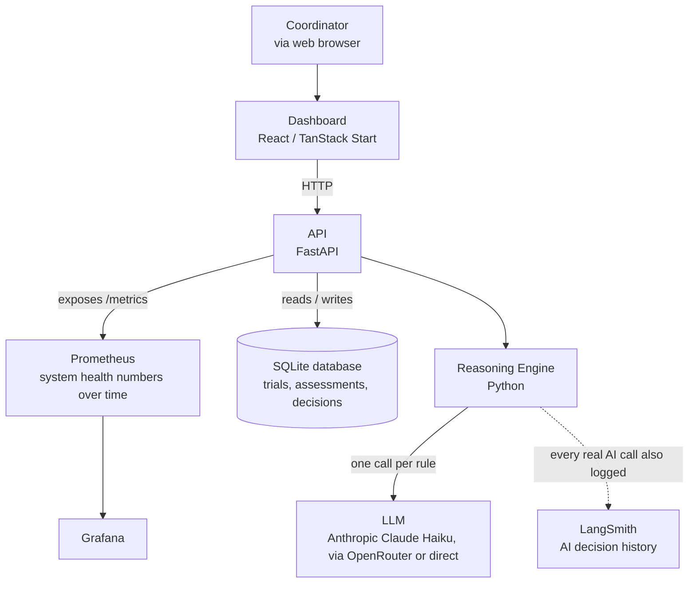

# CareMatch API — Project Summary

**Status: Prototype complete through Phase 5 (simulated). Phases 6-7 require real-world adoption, not more code.**

This document is the single narrative summary of the whole project — what it is, what got built, what actually broke and got fixed, and what the real, honest results are. Everything described here was actually run and verified, not just written and assumed to work.

---

## The Problem

Hospitals running clinical trials have to check whether each patient qualifies, against a checklist of rules (inclusion/exclusion criteria). This is done by hand today, by a **research coordinator** reading through medical records — slow, and easy to miss something in a long chart.

Two things make AI adoption in this space hard in practice:
- **Cost** — typical enterprise AI integrations run \$250K–\$500K per hospital
- **Trust** — a black-box "yes/no" verdict is unusable in a clinical/legal setting with no way to check it

## The Idea

CareMatch is a lightweight reasoning layer, not a black box. It never gives a flat yes/no — every result is a structured, per-rule breakdown with a direct quote from the patient record as evidence, and a human coordinator always makes the final call.

```json
{
  "suggested_status": "likely_eligible",
  "requires_coordinator_approval": true,
  "rule_results": [
    {"rule_id": "INC-01", "status": "matches", "evidence": "60-year-old patient"}
  ]
}
```

---

## What Got Built

| Layer | What It Is | Status |
|---|---|---|
| **Reasoning engine** | Python core that walks a trial's rules one at a time against a patient record, calling an LLM per rule | ✅ Built, tested with a real LLM |
| **API** | FastAPI doorway — register trials, run assessments, record coordinator decisions | ✅ Built, 17/17 tests passing |
| **Dashboard** | React/TanStack Start UI — New Assessment, Assessment Review, Trial Setup, Trials | ✅ Built, wired to the real API, browser-tested |
| **Docker** | All services containerized, one `docker-compose up` starts everything | ✅ 4 containers running together |
| **Observability** | Prometheus + Grafana, built into the real API (not a separate toy service) | ✅ Real metrics, real dashboard |

## Architecture



Every request into the API also passes through a small logging layer: it gets a unique ID (returned in the `X-Request-ID` header), and one structured log line records what happened for that request.

---

## Real Bugs Found and Fixed

This is the part that matters most — not that bugs happened, but that they were found *before* this touched anything real, and each one is now backed by a regression test.

### 1. Negated exclusion phrasing confused the model
**Found:** Exclusion rules phrased as "Patient must **not** be taking Warfarin" caused the model to answer `does_not_match` almost regardless of the actual facts — a double-negative it consistently got wrong.
**Fixed:** Rephrased exclusion criteria as plain, positive disqualifying statements ("Patient is currently taking Warfarin"), and made the prompt explicitly state what a match means per rule category.
**Verified:** Re-tested in a later 12-patient batch — every Warfarin check across all patients came back correctly polarized.

### 2. Overconfident inference from absence
**Found:** Given "no diabetes screening on file," the model confidently answered "does not have diabetes" — inferring a negative from an absence, rather than flagging genuine uncertainty.
**Fixed:** Explicit prompt instruction: prefer `unclear` over an inferred answer whenever the record doesn't state something directly.
**Verified:** A later test specifically contrasted "no history of diabetes" (correctly confident) against "no diabetes screening on file" (correctly unclear) — both handled correctly.

### 3. Malformed LLM output could crash an entire assessment
**Found:** If the LLM returned an invalid status value or a missing field, the whole assessment would crash instead of failing gracefully.
**Fixed:** Wrapped rule evaluation in validation with a safe fallback to `unclear` — one bad rule result can no longer take down the whole assessment.
**Verified:** 4 dedicated tests, including proof that one malformed rule doesn't affect other valid rules in the same assessment.

### 4. Metrics double-counted, wrong model naming, confidence field crept back in
**Found during code review of an early, larger alternative codebase** that was ultimately set aside — a metric was incremented twice per event, status field naming drifted from the locked schema, and a "confidence score" had been reintroduced despite that being explicitly ruled out in planning.
**Action:** That codebase was not used. Confirms the value of the Phase 0 planning discipline — these were real, working-code mistakes that planning decisions were specifically designed to prevent.

### 5. Docker port conflict silently routed traffic to the wrong container
**Found:** An old, unrelated container from early Prometheus/Grafana testing was still running on the same port as the real API. Windows resolved `localhost` to the old container first, causing real requests to silently hit the wrong server and return a misleading 404.
**Fixed:** Retired the old standalone container entirely; observability is now built into the real API, in the same Docker Compose stack — structurally impossible for this exact conflict to recur.

---

## Harness Hardening

Beyond the core reasoning loop, four additional safety layers were built in, addressing gaps identified during initial planning:

1. **Malformed output handling** — see bug #3 above
2. **Prompt injection defense** — patient records are wrapped in explicit data-only delimiters, with instructions to never treat their contents as commands. *(Honestly documented as a real mitigation, not a guarantee — full adversarial testing would need a dedicated red-team exercise.)*
3. **Token usage visibility** — every real LLM call logs its token cost and a running session total
4. **Model/provider traceability** — every assessment records exactly which AI model produced it

**Deliberately not built, and why:** bias/fairness auditing (needs real-world pilot data to be meaningful), model version pinning with rollback (an operational concern for real deployment, not a prototype), formal cost budget caps (visibility came first).

---

## Evaluation Results (Simulated Phase 5)

A real hospital pilot wasn't available for this project, so a substitute evaluation was run instead: 12 synthetic patients, each with a human-decided correct answer, run through the real system end-to-end (real Anthropic Claude Haiku calls, not mocked).

**Result: 12/12 correct (100% agreement), 0 false exclusions.**

The batch was deliberately designed to re-test the two reasoning bugs above, plus:
- **Boundary conditions**: a patient exactly at the age cutoff (correctly eligible) vs. one year under (correctly excluded)
- **Multi-failure cases**: a patient failing three rules simultaneously — all three correctly identified, not just the first one noticed
- **Distractor information**: an unrelated allergy noted in the record, correctly ignored

**Honest limits of this result:** 12 cases is a real signal, not statistical proof — a larger batch (30-50+) would be more robust. One trial with three simple rules is far simpler than a real trial's typical 10+ criteria. This was synthetic, clean data — real clinical notes are messier and more inconsistent.

---

## The Senior-Review Round

A later senior review of the finished prototype led to another round of real work. Everything below was actually changed, rebuilt, and verified against the running system — not just edited and assumed fine.

### SQLite persistence — the app stopped forgetting

The prototype originally kept trials and assessments in memory, so restarting the app wiped everything. Trials, assessments, and coordinator decisions now live in a real SQLite database (`api/db.py`). This was proven with the harshest test available: we actually killed the running server process, restarted it, and confirmed the data came back exactly as it was.

### LangSmith tracing — the AI's reasoning is now recorded

Every real AI call is now logged to LangSmith, so an individual decision can be reviewed long after it happened. This is proven with real evidence, not a claim: a live assessment produced three successful trace records, each with its own run ID and a direct link to the full reasoning inside LangSmith.

Setting it up surfaced a genuine authentication bug. The key in use is an org-scoped "service" key, and LangSmith quietly rejected every request with `403 Forbidden`. The cause: org-scoped keys need an explicit **workspace ID** in the configuration, and we hadn't set one. Adding `LANGSMITH_WORKSPACE_ID` fixed it, and the traces then appeared.

### Request logging — every request is now traceable

A small middleware layer gives every API request a unique ID, returned in the `X-Request-ID` response header and written into one structured log line (which endpoint, how long it took, what it returned). Proved with a real request: the header on the response and the corresponding log line matched, byte for byte.

### Prometheus config — renamed, expanded, and one genuine lesson

The monitoring config was renamed to `prometheus_config.yml` and expanded with clearer scrape settings and a job that watches Prometheus's own health. The expansion surfaced a real mistake: retention settings were first put in the config file, and Prometheus refused to start, rejecting the file with a real startup error (`field retention.time not found in type config.plain`). Retention cannot live in the config file — it has to be a command-line flag. The fix was to pass `--storage.tsdb.retention.time=30d` when starting Prometheus, after which the config loaded cleanly and both monitored targets reported healthy.

### Coordinator decisions — from 2 options to 3

The decision system was redesigned from two options ("Approve" / "Override") to three: **Accept**, **Deny**, and **Needs More Review**. This was a deliberate design change, not a rename:

- **Accept** and **Deny** are final — once recorded, the assessment is locked.
- **Needs More Review** is deliberately not a dead end. It keeps the assessment open and flagged, so the coordinator can come back later and finish with a real Accept or Deny once the missing information arrives.

The hard part was the data already in the database. Older assessments stored decisions as `"approved"` or `"overridden"`, and the new code had to keep reading those rows without crashing — and without rewriting them, since they are records of what actually happened. The solution: the API only accepts the three new values on input, but tolerates any stored value on output. Proven with the real database: an old `"approved"` row still loads and displays correctly today.

### The Trials list page

The dashboard gained a fourth page — **Trials** — which lists every registered trial and its rules in a plain, expandable view. It sits in the top navigation alongside New Assessment, Assessment Review, and Trial Setup.

---

## What's Genuinely Left (Not Code)

| Phase | What It Actually Requires |
|---|---|
| **6 — Compliance** | Real legal review (HIPAA), a real third-party security audit |
| **7 — Scale** | Real hospital customers, a business model, a larger trial-protocol library built from real demand |

Both of these need an actual organization adopting this system — they are not things more engineering time can produce on their own.

---

## Repository Structure

```mermaid
flowchart TD
    ROOT[carematch/] --> RE[reasoning_engine/<br/>Phase 1 — core AI reasoning logic]
    ROOT --> API[api/<br/>Phase 2 — FastAPI doorway + SQLite persistence + Prometheus metrics]
    ROOT --> DASH[dashboard/<br/>Phase 3 — React/TanStack Start coordinator UI<br/>New Assessment, Assessment Review, Trial Setup, Trials]
    ROOT --> EV[run_evaluation.py<br/>The 12-patient accuracy test script]
    ROOT --> PS[project_summary.md<br/>This file, at the project root alongside README.md]
    ROOT --> SETUP[setup_guide.md<br/>Step-by-step setup instructions]
    ROOT --> SEED[seed_data.md<br/>Copy-paste examples to try once the app is running]
    ROOT --> MON[monitoring_guide.md<br/>What Prometheus and Grafana are, and how to use them]
    ROOT --> DC[docker-compose.yml<br/>Runs the full stack: api, dashboard, prometheus, grafana]
    ROOT --> PC[prometheus_config.yml<br/>Monitoring config — data retention is a command-line flag, not set here]
    ROOT --> README[README.md<br/>Living technical status, updated throughout the build]
```



---

*This document reflects the project's actual, verified state as of the end of active development. Every claim above was tested and confirmed running — not assumed.*